# Test report

This document details the verification and validation process for the DeSeNet Protocol Stack implementation on the Sensor node. The primary goal is to ensure that the Sensor node correctly synchronizes with the network, acquires sensor data (accelerometer and joystick), and transmits this data to the Gateway within the assigned time slots using the `MultiPdu` frame structure.

The testing process focuses on validating the protocol logic, state machines, and hardware abstraction layers to guarantee reliability and compliance with the DeSeNet specifications.

## Setup

To ensure a robust implementation, the verification strategy consists of two distinct phases. Most test cases will be executed in both environments to validate functional correctness and timing constraints. But some tests does not make sense to replicate on the real setup (internal tests), so those will be executed only in a simulated environment.

1.  **Simulation Phase:** Validates logic and protocol behavior in a controlled, software-only environment.
2.  **Real-Life Phase:** Validates the implementation on the target hardware, accounting for real-world timing, radio interference, and hardware interrupts.

### Simulator

The simulation environment allows for rapid development and debugging of the protocol stack without requiring physical hardware. It relies on three key components interacting on a software level :

*   **Mesh Simulator (AppImage):** A Qt-based application that visualizes the network topology and simulates the wireless medium (ether). It manages the virtual connections between the Testbench and the Sensor.
*   **DeSeNet Testbench (AppImage):** Acts as the **Gateway** of the network. It periodically broadcasts Beacon frames, defines the network schedule, and listens for responses from the Sensor. It serves as the reference implementation to verify the Sensor's behavior.
*   **Sensor Application (Qt Build):** The "Device Under Test" (DUT). This is our implemented code compiled for the host PC (x86_64). It runs the full protocol stack, simulating hardware peripherals (accelerometer, joystick) through the simulator's interface.

Here is a picture of the setup in the simulator bench.

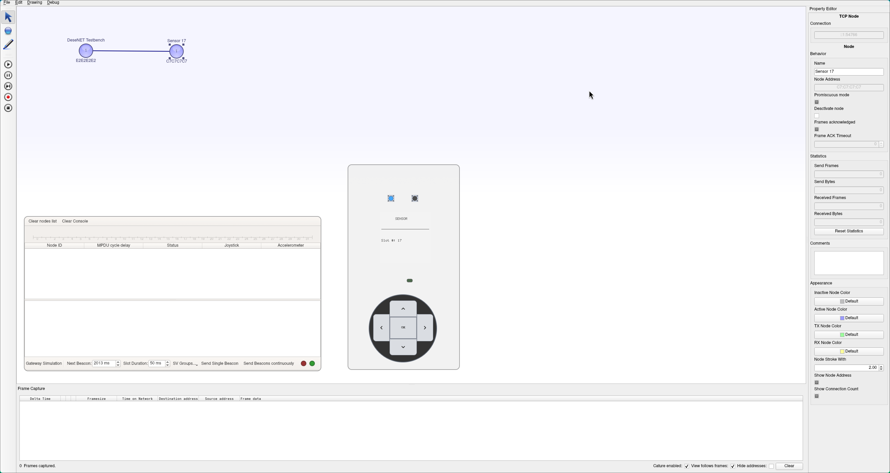

### Real life

The real-life setup involves deploying the verified code onto the actual embedded target to validate performance in a physical environment:

*   **Target Hardware:** A wireless capable circuit board, equipped with a joystick (composed of 5 buttons) and an accelerometer
*   **Gateway:** A physical Gateway node (provided in the laboratory) that acts as the network master, broadcasting real beacons and collecting data.
*   **Debug Interface:** Serial/UART output from the Nucleo board is used to monitor logs (`Trace::out`) and verify internal state changes during operation.

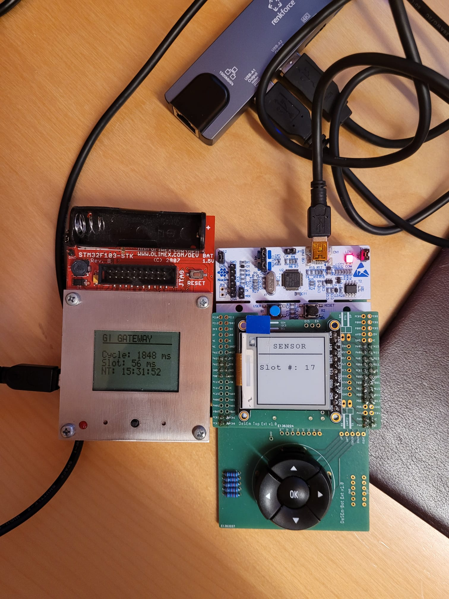

In this picture, on the left, the gateway, controlled from the computer by a serial port connection. And on the right, the sensor node, *not controlled* by the PC (indicated by the solid red led).

Now, we can connect to the gateway to control it by launching the test bench.

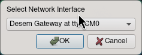

And, as shown in this picture, selecting the correct TTY port to connect to the gateway

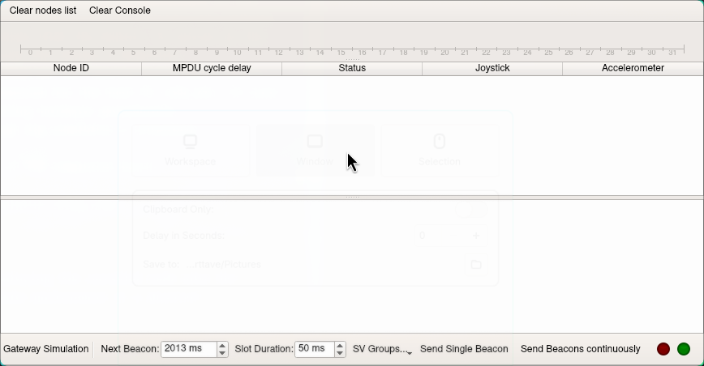

Once this is done, we will access the same interface as in the simulator, this interface allows us to control the gateway

## Tests cases

- Node receive correctly the beacon frame (**simulator only**)

For this test, we will add a log in the `onReceive` method of the network entity to print out to the console the moment a beacon is received.

- Beacon receive response correctly and updates the accelerometer value (if needed)

For this test, we will check if value received by the beacon seems correct

- Node add correctly the events to the MDPU when needed (**simulator only**)

For this test, we will add a log in the `onTimeSlotSignal` of the network entity, to ensure that we correctly add the events to the MPDU when needed

- Beacon receive response correctly and updates the joystick (if needed)

For this test, we will check if the joystick buttons value are correctly updated when needed in the beacon

- Node response without accelerometer value when SVGroup 2 is not asked for

For this test, we will send a beacon without the SVGroup2, to check if the response correctly contains no accelerometer value

- Node does not respond if there is no event to send (when SVGroup 2 is still not asked for)

For this test, we will still send a beacon without the SVGroup2, but this time we will check that the node does not respond anything if no joystick buttons are pressed (this means that no new events occured)

## Simulator results

### Beacon reception

For this test, we send a single beacon from the test bench.

And we expect to see the `Beacon received !` log appear in the console, which does appear as seen here

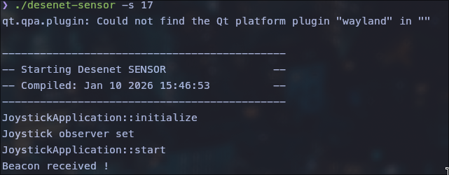

### Node response with accelerometer value

This is the same setup as the preceding test, as we are sending a single beacon, but this time, we are expecting a response from the node (during the time slot 17).

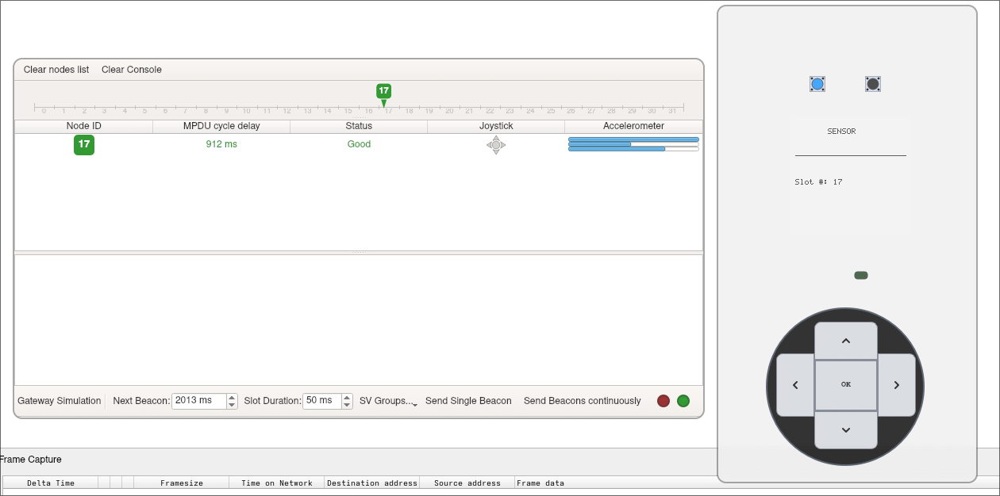

As we can see from this picture, the node respond during the correct time slot, with a correctly formatted MPDU. To check if the accelerometer value is correctly update, as we're simulating the node in software, we can move the sensor window and check if the value changes.

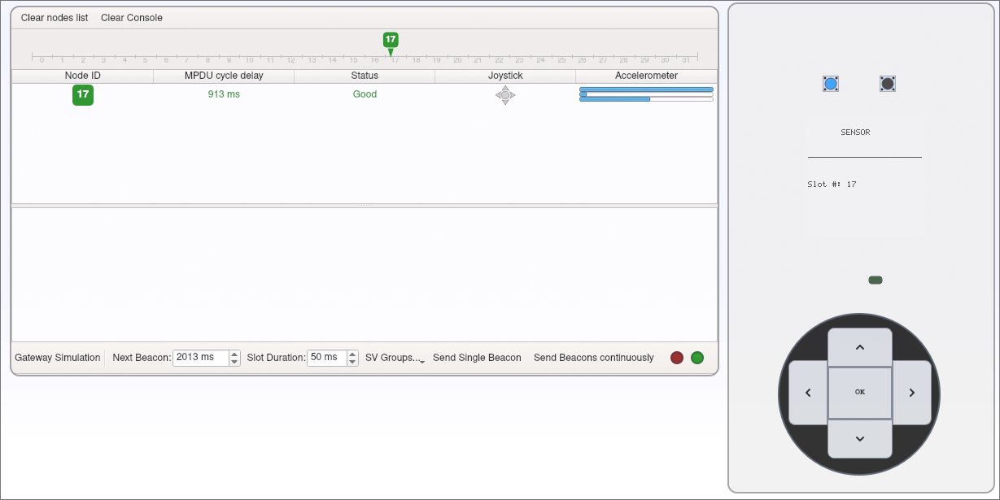

As we can see, once the window was moved, the value was correctly updated on the next beacon sent (and response received).

### Node adds event to the MPDU

For this test, we want to check if a log appear in the console when a new Event is added to the MPDU. So first, we click on a joystick button of the node, as we can see, the event is correctly detected.

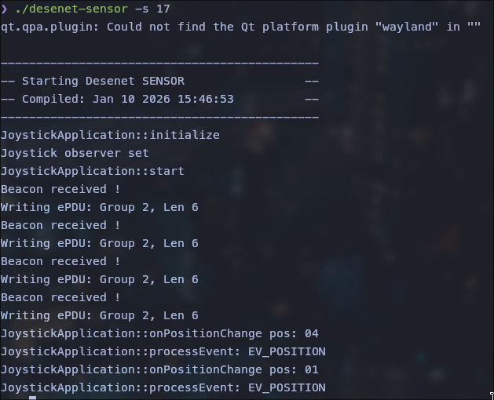

Now, we can send a single beacon, and check the logs again.

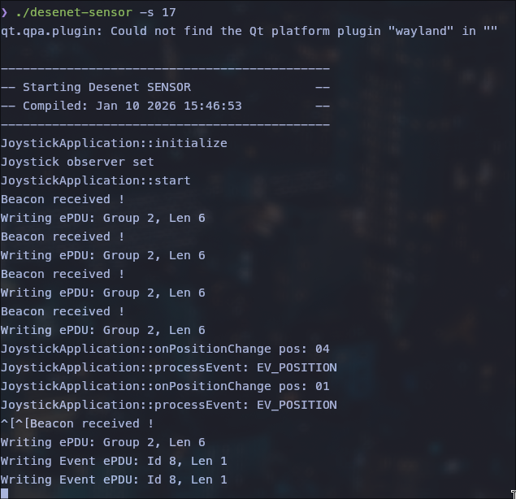

And as we can see, there is two new logs concerning the events. This is because there is a press and release event being added to the MPDU. So this validates our test.

### Beacon receives joystick update

For this test, we will first press on the joytick, and send a single beacon. As there is no release event for now, the beacon should show that the joystick button is pressed.

As shown in the first picture, the expected result is correct. We will then release the joystick, and send a new beacon, that should update the joystick status in the beacon.

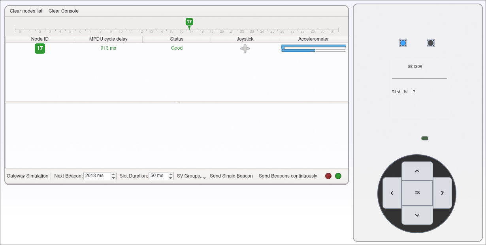

As shown in the second picture, the expected result is correct

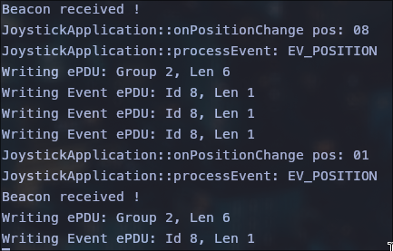

This picture show the detail of the complete test.

In order :
- The beacon is received
- The joystick button is pressed (before the response is sent !)
- The response is built and sent (with the button press event)
- The button is released
- A new beacon is recevied
- The response is built and sent (with the button release event)

This validates this test

### Node does not respond without any event

For this test setup, we will deactivate the SVGroup2 in the beacon as shown in the picture below :

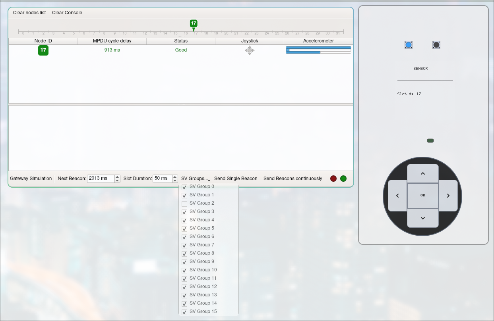

The goal of this test is to see if the node still receive and treat the beacon, but does not respond as there is no new event to publish (and the accelerometer value is not asked for).

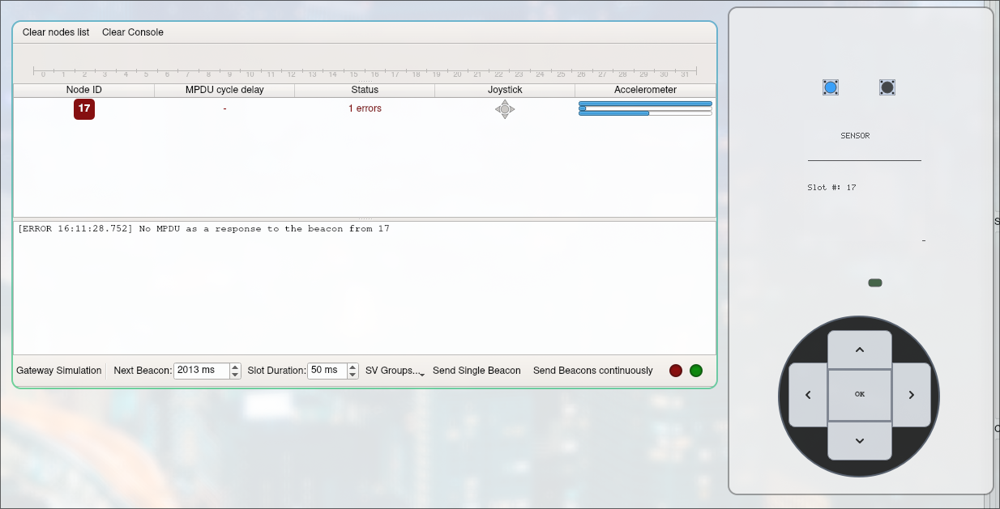

As shown in this picture, the node does not respond to the beacon (which causes an error, but this is expected behaviour). This tells us that the node correctly stayed silent.

And this picture ensure that the beacon was received by the node. Correctly interpreted, and that the accelerometer was correctly skipped as it was not asked.

### Node respond if a new event is added

The setup of this test is the same as the preceding, with the SVGroup2 deactivated in the beacon settings.

The goal of this test is to check that if there is new event to send to the beacon, we want to ensure that the node will respond (even when svgroup2 is deactivated).

To do this, we start by sending a beacon, and we expect no response as no new events as taken place.

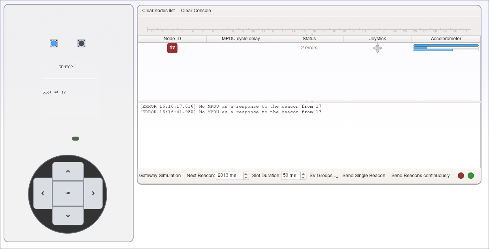

As seen in this picture, we have no response from the node. We can then click on the joystick, which will add two events to the queue (button down and then up).

So then, when we re-send a beacon, we can see that the node respond with the two events

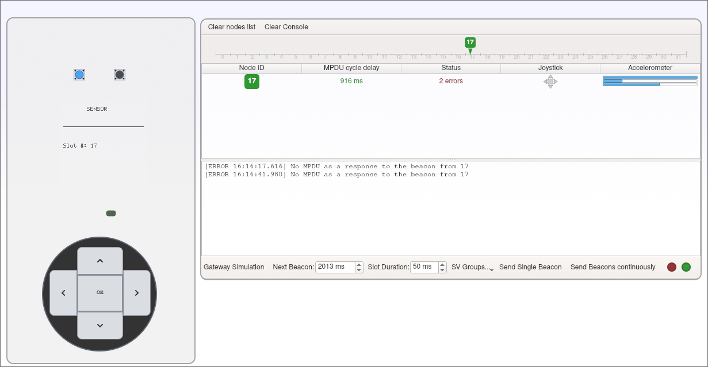

We then move the window elsewhere, click on the joystick again to ensure a response, and send a beacon.

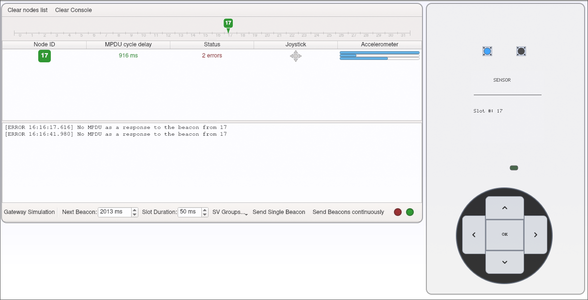

And as expected, the node respond with the new event. **But the accelerometer value stays the same !**

We now re-activate the svgroup2, and re-send a beacon just to ensure that the accelerometer value would change.

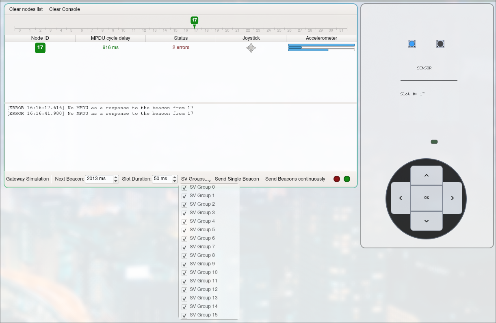

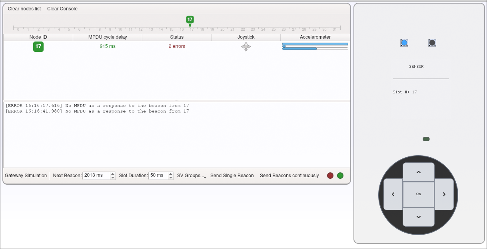

And as we can see, the accelerometer value updated correctly !

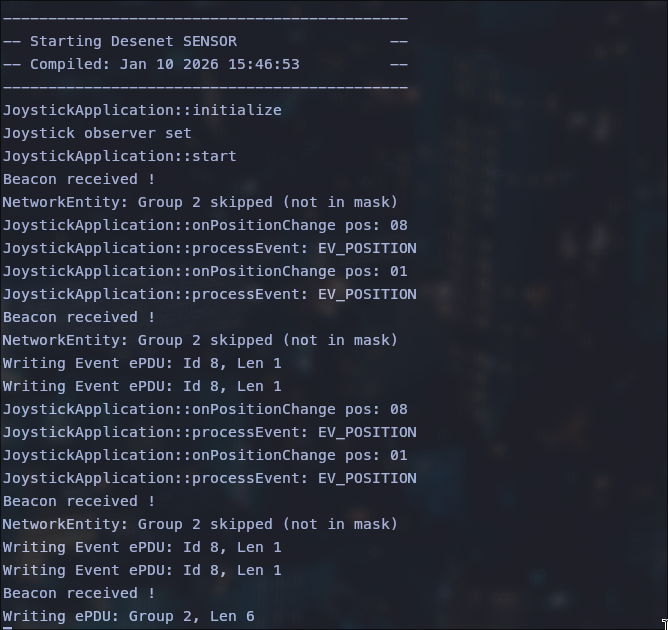

Here are the logs of the node, explained as follows :
- First, we receive the beacon, we skip group2 and send no response as there is no event
- Then, two events are added to the queue (button down and up)
- We receive a new beacon
- We still skip the accelerometer group, but we add the two events to the MPDU
- We send the response
- We add two new events to the queue (button down and up)
- We receive a new beacon
- We still skip the group 2
- We add the events to the MPDU, and send the response
- We receive a beacon
- We send the updated accelerometer value

## Real-life results

- Beacon receive response correctly and updates the accelerometer value (if needed)

For this test, we will check if value received by the beacon seems correct

- Beacon receive response correctly and updates the joystick (if needed)

For this test, we will check if the joystick buttons value are correctly updated when needed in the beacon

- Node response without accelerometer value when SVGroup 2 is not asked for

For this test, we will send a beacon without the SVGroup2, to check if the response correctly contains no accelerometer value

- Node does not respond if there is no event to send (when SVGroup 2 is still not asked for)

For this test, we will still send a beacon without the SVGroup2, but this time we will check that the node does not respond anything if no joystick buttons are pressed (this means that no new events occured)

### Beacon receive and update accelerometer value

For this test, the goal is to check that even in real life, the node respond to the beacon with the correct format, and send correct accelerometer value.

To do this, we will send a single beacon from the gateway, and see if the node respond correctly.

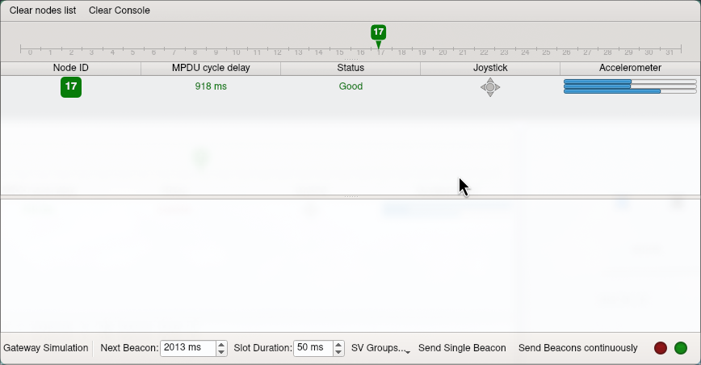

And as shown in the picture, the node respond correctly. We will now move the node from laying flat to laying on its side, and re-send a beacon to see if the accelerometer value updates correctly.

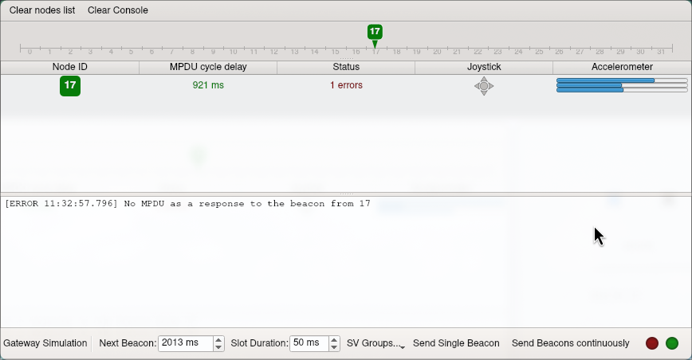

And as shown, the value update correctly, so this validates our test.

### Beacon receive and update joystick value

To realise this test, we will press down on the center joystick button, then send a beacon.

As shown in the picture, the joystick button state update correctly

Then, we will release the button, and re-send a beacon

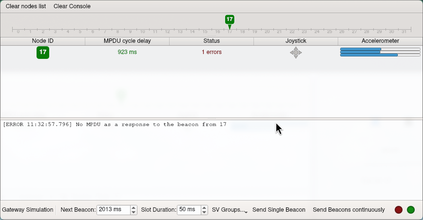

And, as expected, the new state is correctly received by the gateway, and updated in the GUI, so this result validate our test.

### Node does not respond when no new events happened

For this this, we will deactivate SVGroup2 from the beacon, then send a beacon, and we expect no response as there is no new event to send.

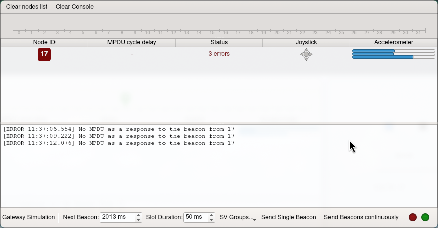

### Node respond only when there are new event

For this test, we will start by keeping the svgroup2 unchecked, and send a beacon and expect no response.

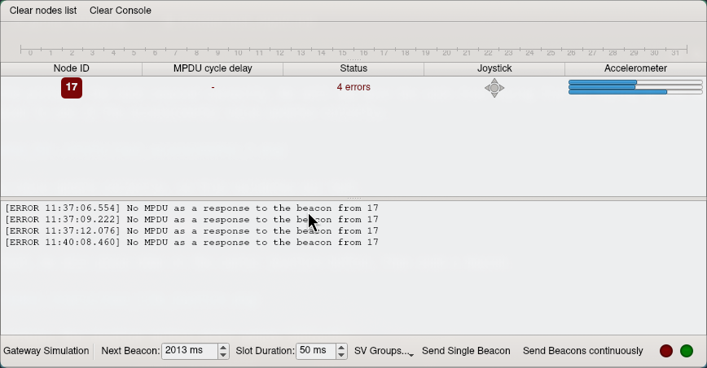

Then, we will press and release the joystick, and send a single beacon. This time we expect a response.

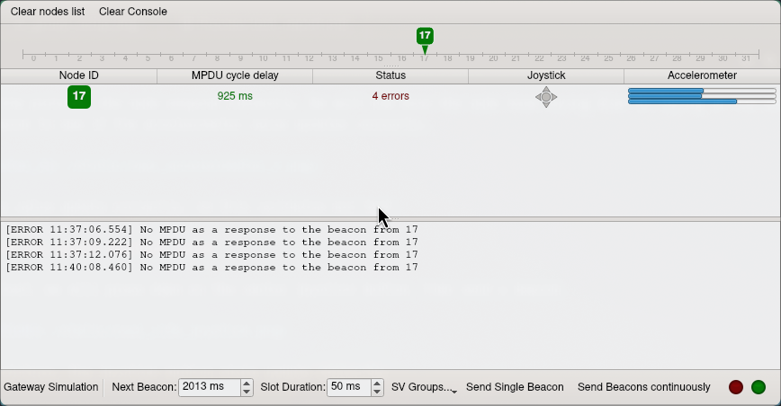

This confirms that the node respond only when there is a new event, and that the response does not contains accelerometer value.
